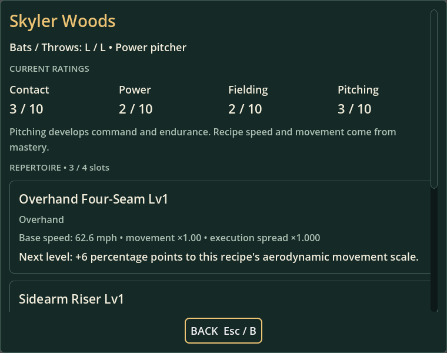
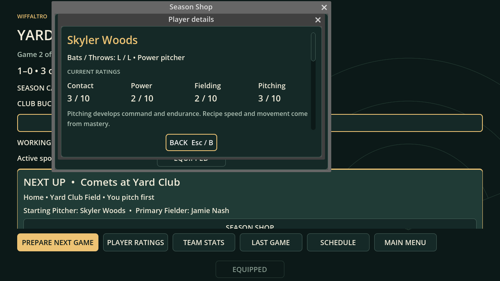
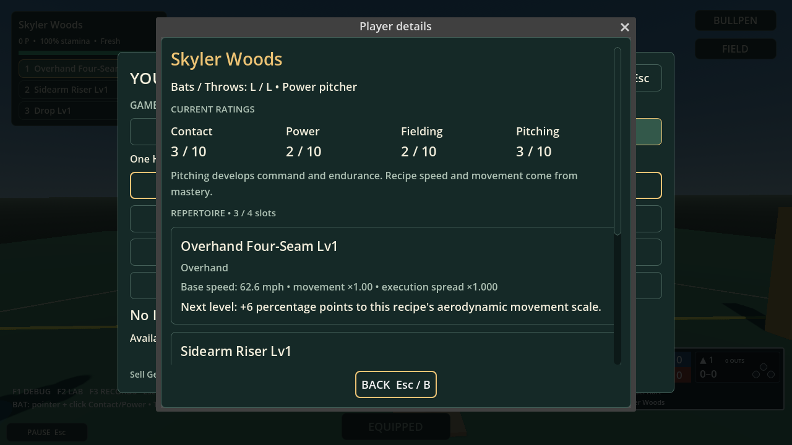

# Player inspection review, 2026-10-02

The shared inspector completes a bounded player-inspection contract while preserving the shop and live Equipped flows. Build41/save45/Career21 and content counts are unchanged. Whole-project estimate remains approximately75%, not release readiness.

## Contract and primary references

The current WIFFALTRO_PLAYERS_PITCHES.md v17 requires inspection in draft, roster, lineup, shop/targeting, equipment and legal substitution/pause contexts without losing the pending action, with actual next-level effects. The implementation reads existing player definitions and PitchMastery.next_effect; it introduces no purchase or progression command. Decisionsv31, Equipmentv18, planning blueprintv114 and Economyv24 were consulted. The repository blueprint remains byte-identical to main.

Reviewed Godot's primary [Window documentation](https://docs.godotengine.org/en/stable/classes/class_window.html) for embedded popup coordinates and [pausing documentation](https://docs.godotengine.org/en/stable/tutorials/scripting/pausing_games.html) for physics/process-mode behavior. Default embedded dialogs use root-relative coordinates, so a small shop needs its own origin included explicitly. Always-processing match nodes also retain the existing match pause guard. The earlier official Balatro press-kit observations in SHOP_UI_REVIEW continue to inform a consistent utility entry, layered details and a clear return action. No reference artwork was copied.

## Reviewed native screens

Unedited Godot4.7.2 viewport captures from final-source run20261002T201213302920Z. The renderer uses X11/OpenGL4.5 Compatibility and Mesa25.2.8 llvmpipe with Dummy audio.

Four Working ratings share one row. The first recipe's current level, delivery, base speed and authoritative next-level effect fit together. The visible scrollbar reaches the remaining recipes and learned descriptions; Back stays fixed.

At700×400, the dialog uses the shop's extent and position rather than the overall screen center. Text wraps, the scrollbar remains visible and Back stays inside the client. The original recipient choice remains behind the modal.

The current managed-team definition is displayed above the existing Equipped lightbox. Returning dismisses player details; Equipped remains open and keeps the match paused. Closing Equipped restores the captured running/pause state. The centered Equipped entry is preserved.

Native review caught an oversized unwrapped minimum, a misplaced small-shop child popup, excessive ratings height and an invisible scrollbar; the final implementation addresses these without reducing the bounds assertions. The actual-wheel fixture now sends complete press/release pairs, allowing subsequent Back clicks to behave like real pointer input.

## Hands-on acceptance, pending

Use the isolated project workflow in SHOP_ACCEPTANCE with the current checkout. The previous prepared review copy is an older checkpoint; create a fresh destination for this slice.

1. Inspect an offered draft player, scroll through recipes, and return with Back/Escape/B. The original selection and Draft action should remain intact.
2. Inspect a roster player and a lineup name. Check rating readability, hands, levels and actual next effects; lineup arrows retain their previous purpose.
3. Open a shop recipient screen at normal and small sizes. Inspect and return, then review the original target. Cash, offers and the pending choice should agree with the saved state.
4. Open Equipped in the shop and during play; use Abilities to inspect a player, including one with no learned ability. Returning closes only player details. Close Equipped separately.
5. Before a defensive pitch, open Bullpen and Details. Inspecting must not select that pitcher. Return to the same bullpen plan. Repeat from paused match stats; return to the existing pause.

Human readability, controller hardware, response feel, camera comfort and final cohesive whole-game UI acceptance remain pending. Automated viewport input and software-rendered screenshots do not establish these approvals. Permanent player ownership/card packs, broader AI acquisition, higher League/tier gameplay and stadium progression remain separate work.
