# Shop and Equipped native review, 2026-10-02

This bounded presentation slice preserves the centered Equipped entry and existing sale semantics. It is not final whole-project UI or human acceptance. Build41/save45/Career21 are unchanged; all25 Gear and35 sponsors remain integrated. Overall project estimate: ~75%.

## Primary references

Reviewed the publisher's [official Balatro press kit](https://www.playbalatro.com/press-kit/) and its actual [shop screenshot](https://www.playbalatro.com/press-kit/Screenshots/Balatro_ui_3840x2160_2.png), [game screenshot](https://www.playbalatro.com/press-kit/Screenshots/Balatro_ui_3840x2160_3.png), and [deck modal](https://www.playbalatro.com/press-kit/Screenshots/Balatro_ui_3840x2160_1.png). Their currency/inventory regions stay consistent across play and shop, prices sit beside the objects, and modal content has a clear return action. These are visual observations of primary assets, not a specification for Wiffaltro's economy. No reference artwork was copied into the game.

Applied to Wiffaltro: preserve one centered Equipped entry; keep the saved Cash balance in the lightbox header; place refund actions beside item names; separate effects from status; make selected Collection categories visibly affirmative. The shop now explains seasonal ownership/access instead of obsolete implementation counts. Long effects remain scrollable; small-window spacing gives them more room.

## Reviewed native screens

Generated by the actual Godot4.7.2 renderer in final verification20261002T142702852879Z. These are unedited viewport captures, not mockups or a recreated browser interface.

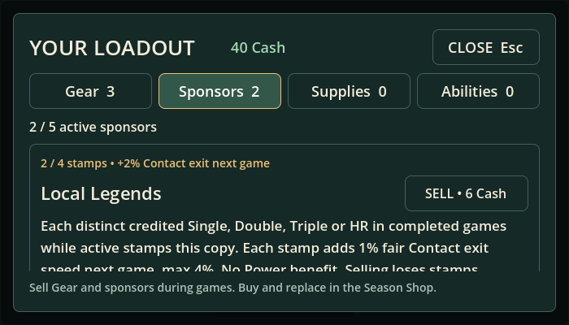

The700×400 shop client keeps Close, Cash, category tabs, refund action and footer inside the panel. Effects scroll independently; the centralized entry returns on dismissal. Keyboard/controller modal focus and existing-pause restoration are covered separately by interaction checks.

The saved13-Cash balance and sale confirmation are visible while the sold Taped Bat retains its current-PA effect. It has no sale action after ownership removal. Text plus color communicate retirement, rather than color alone. Failed save keeps the original balance and copy; successful retry updates the header. Underlying live inventory/receipt logic is unchanged.

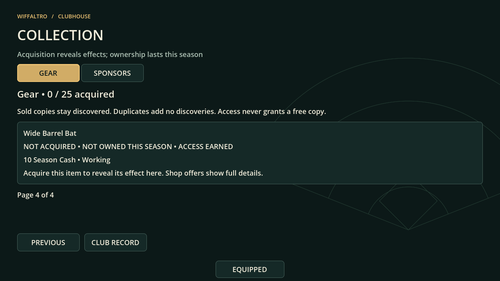

Gear is visibly selected and agrees with the displayed category on its fourth page. Acquisition/access/ownership remain separate, and unacquired effects stay concealed. All60 entries across four Gear and five sponsor pages are exercised.

## Environment and limits

X11 display via isolated Xvfb21.1.12, OpenGL4.5 Compatibility, Mesa25.2.8 llvmpipe software rendering. Xvfb/libXfont/xkbcomp/libxkbfile Ubuntu packages were extracted into scratch, without system package installation. A scratch-only Xvfb binary path adjustment points its keyboard compiler at the extracted tool; the repository engine is unchanged. Server and verification run inside the same tool network namespace, using TCP because local Unix display sockets are unavailable. Dummy audio avoids requiring a host output device. The disposable display is terminated after verification.

32 native captures;14/14 final checks. No engine errors; native V-Sync control is unsupported and the display has nonfatal keyboard/getifaddrs warnings. No full physical games were added in this UI slice. See VERIFICATION for exact earlier failures and current scope.

Human visual/feel acceptance is still pending. Screenshots do not establish response feel, camera comfort, hardware performance or complete whole-game UI quality. Continue shop/UI integration before larger systems. The intermittent combined Collection early exit remains open; focused Collection coverage does not fix that problem.

## Offer browsing follow-up

The same primary-reference observations now guide the shop itself: Cash and held/sponsor capacity remain above the scrolling list; ordinary offers group category, name/price, effect and actions in separate cards. Offers precede services and current inventory. Existing development operations now explain their effect/cap before target selection without changing catalogs or economy.

These unedited Godot captures are from `20261002T151339495665Z`:

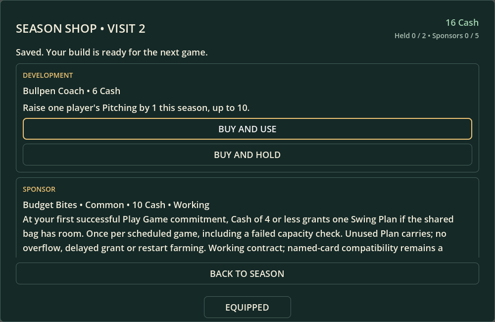

At1000×650, the first development effect and both use/hold actions are readable together. The next card remains reachable by scrolling. Back and Equipped remain separate and visible.

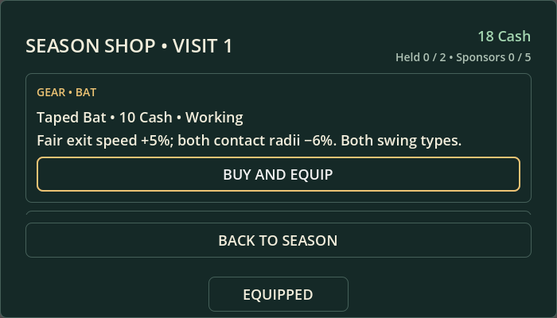

At700×400, Taped Bat's category, price, effect and44-pixel purchase action fit in the visible card. Cash and capacity stay fixed; Equipped remains centered at the same entry position.

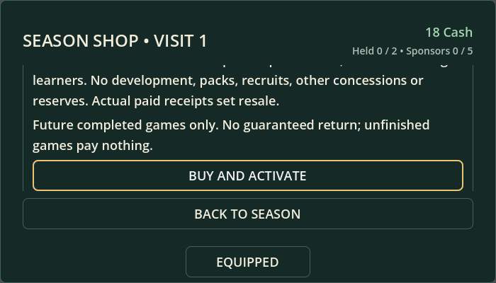

Long descriptions scroll when focus moves to their purchase action. The corrected layout waits for wrapping to settle, keeping that focused action fully visible after resizing. The full description is available by scrolling upward; it is not truncated in the data. Native geometry checks cover focused actions as well as horizontal bounds.

The broad run passed17/18 checks with79 native captures. Only school-shop exited0 before its completion marker; no engine error established the cause. The earlier synchronous scrolling implementation failed actual focus bounds and was corrected, not bypassed. See VERIFICATION for the focused rerun. Human visual/feel acceptance remains pending.

## Authoritative purchase feedback

The official Balatro shop reference continues to inform adjacent price/action information. This follow-up also consulted [Godot's primary ScrollContainer documentation](https://docs.godotengine.org/en/stable/classes/class_scrollcontainer.html): reserved scrollbar space stabilizes content width, and new controls require a later layout frame before ensure_control_visible. Wiffaltro uses reserved vertical width and one deferred correction; repeated corrections were rejected after they fought pointer scrolling.

These unedited native Godot captures are from `20261002T161351846929Z`,8/8 checks:

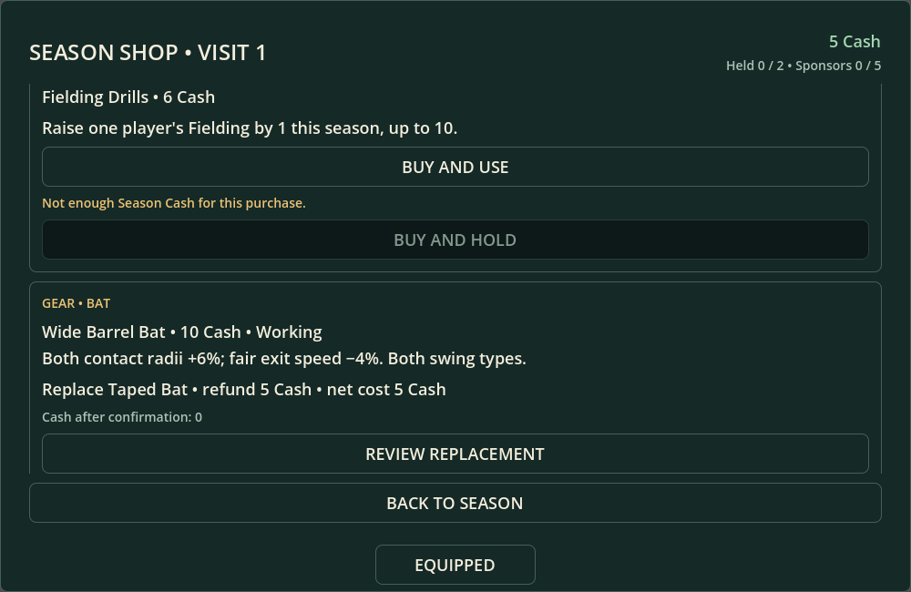

The controlled5-Cash wallet can cover a10-Cash Bat because the owned receipt returns5. Refund, net cost and resulting0 Cash are visible beside the existing review action. Inspection and cancellation leave the purchase uncommitted.

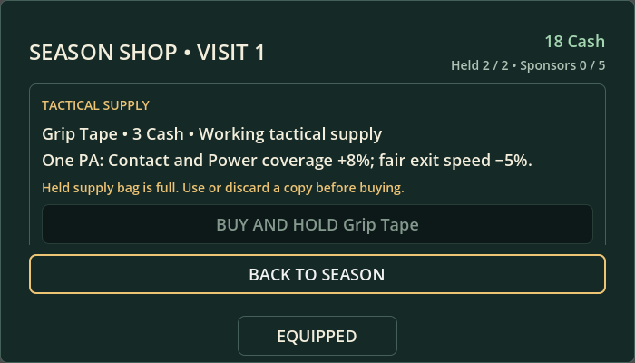

At700×400, Held2/2 agrees with the blocked tactical purchase. The reason uses text plus gold color; the disabled action retains its effect/price above it. This capture scrolls to inspect the card with Back focused, rather than following focus to an enabled service below it.

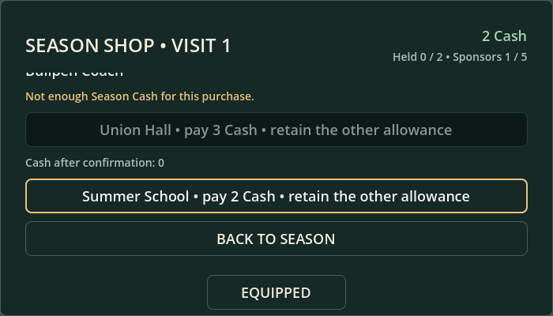

At2 Cash, the3-Cash Union choice is disabled while the2-Cash Summer School choice remains available and projects0 Cash. The allowances cannot stack. Actual input reaches the exact final review; cancellation consumes neither allowance.

The surrounding screenshots and common native environment limitations above still apply. Broad16/18 plus corrected focused9/9 twice and final quote8/8 are recorded in VERIFICATION. No copied reference artwork, new economy values, human visual approval or whole-project UI acceptance is implied.

## Service and completed-recipient follow-up

Rechecked the same official Balatro press-kit shop asset: price/action proximity and stable wallet/inventory remain the primary visual observations. This bounded service slice extends Wiffaltro's existing quotes rather than changing economy values or copying reference art. Also checked [Godot's Viewport focus signal](https://docs.godotengine.org/en/stable/classes/class_viewport.html#signals) and [ScrollContainer behavior](https://docs.godotengine.org/en/stable/classes/class_scrollcontainer.html). Final focus correction responds to actual body/scroll geometry and cancels superseded layout events, addressing the measured recruitment clipping failure while retaining mouse-scroll freedom.

These unedited native captures come from `20261002T164729046408Z`,19/19 checks,79 captures:

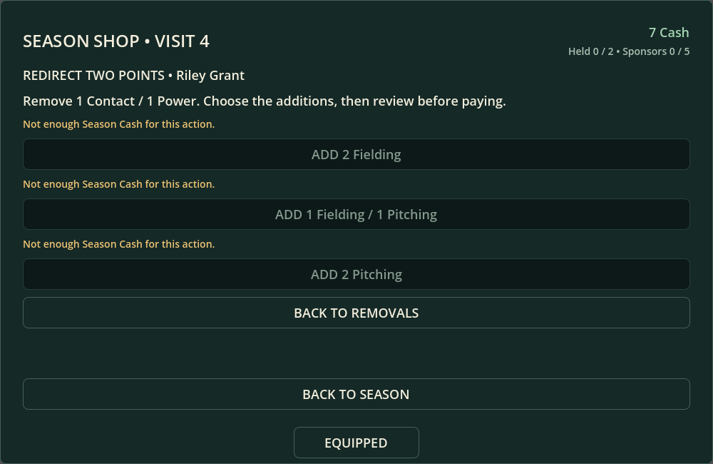

At1000×650, the7-Cash header agrees with the disabled8-Cash transformation choices. Each reason remains readable; Back to removals, Back to season and the centered Equipped entry remain available. The same page at8 Cash enables each exact addition and quotes0 Cash. Inspection leaves live diagnostics, points and wallet unchanged.

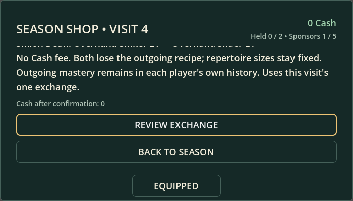

At700×400, the exchange action stays fully visible with0 Cash. The outgoing mastery/repertoire consequences scroll above it, and the explicit no-fee description is visible. Actual input reaches the final review, whose Cash outcome agrees; cancellation leaves both players unchanged.

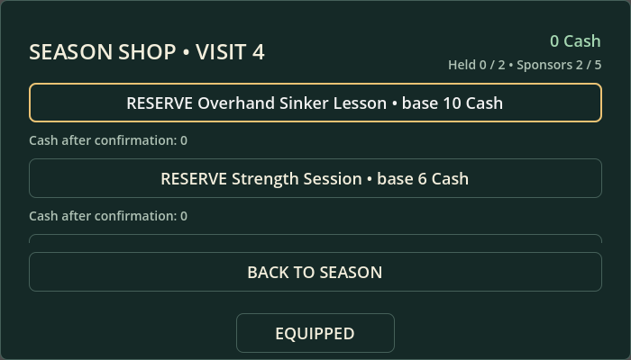

At700×400,0-Cash reservation choices retain the item's future base price beside the action. Reserving spends no Cash now. The final review still controls reserve-and-leave; Cancel leaves stock and the current visit intact.

Additional final recruitment and category captures were inspected for fully visible focused buttons after narrow resize. Existing effects and player ratings remain scrollable. Shared native environment limits above apply; no engine errors in the final scope, no new complete physical games. This bounded review is not human visual/feel acceptance or the final cohesive whole-game UI pass.

## Quoted choice context follow-up

The same [official Balatro shop asset](https://www.playbalatro.com/press-kit/Screenshots/Balatro_ui_3840x2160_2.png) informs keeping price information adjacent to actions. [Godot's primary ScrollContainer reference](https://docs.godotengine.org/en/stable/classes/class_scrollcontainer.html) confirms that focus scrolling supports indirect children and needs completed layout. Wiffaltro now scrolls the compact context/quote/action group as a unit when it fits the viewport, preserving a visible action for taller content. The existing coalesced layout correction remains; manual scrolling does not trigger it.

These unedited captures are from native verification `20261002T172540421436Z`,23/23 checks with103 captures:

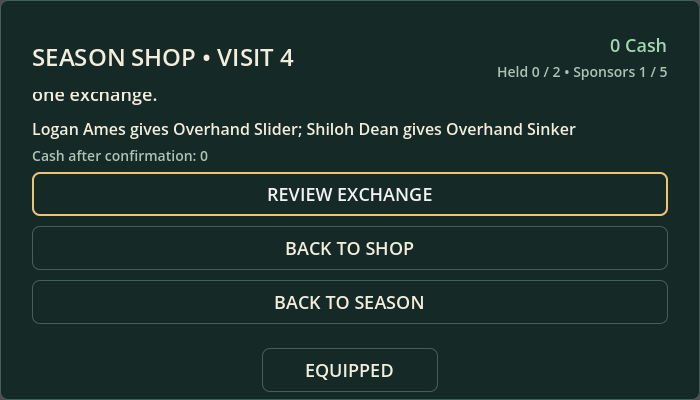

At700×400, Logan Ames/Overhand Slider and Shiloh Dean/Overhand Sinker remain visible with the0-Cash outcome and exchange action. Full mastery/repertoire consequences are still available above by scrolling and in final confirmation. Back to shop, Back to season and the centered Equipped entry remain visible.

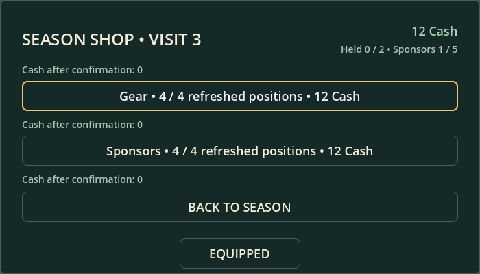

At700×400, the12-Cash Gear reroll and resulting0 Cash remain together. The earlier button-only focus target could scroll the preceding quote out of view. Focus geometry now checks the full group, retaining the existing44-pixel action and fixed saved balance.

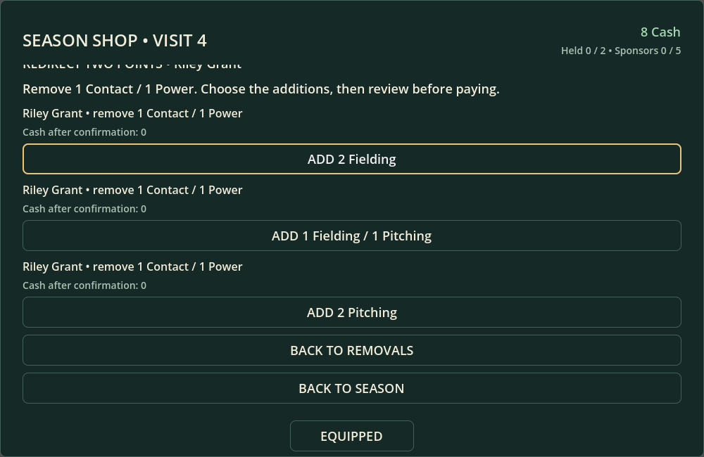

At1000×650, each addition repeats Riley Grant and the Contact/Power removal with its0-Cash outcome. The selected addition remains keyboard-focused; Cancel preserves the original8 Cash and points. No operation or economy change is implied by these controlled boundary renders.

Actual pointer motion/wheel input additionally checks that browsing can scroll away from the selected quote without snap-back, changing focus or purchasing. Native screenshots remain distinct from human visual/feel acceptance; the final cohesive whole-UI pass is still open. Existing software-display limitations apply.

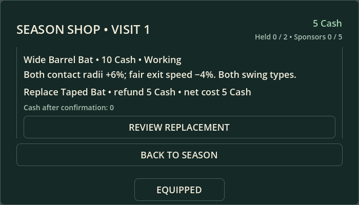

At700×400, the Wide Barrel effect,10-Cash list price,5-Cash Taped Bat receipt refund,5-Cash net cost and resulting0 Cash are visible with the replacement action. This controlled boundary render retains Working status. Four final screenshots were reviewed/copied verbatim; all sixteen scene scopes passed, including the actual wheel test. No human visual/feel approval is implied.

## Consolidated confirmation and acceptance preparation

The final shop integration audit found that individual button minimum sizes did not survive Godot's AcceptDialog layout. The primary AcceptDialog theme API supplies the actual button-height setting. Purchase and Equipped sale confirmation content now uses the clubhouse surface/paper palette, with both bottom actions measuring44 pixels in the native viewport. Existing default exclusive/transient behavior is preserved; the new pointer test checks blocked background dismissal rather than claiming a newly added modal behavior.

These unedited captures come from20261002T182836026823Z. They are controlled regression fixtures rendered by Godot, not a human playthrough.

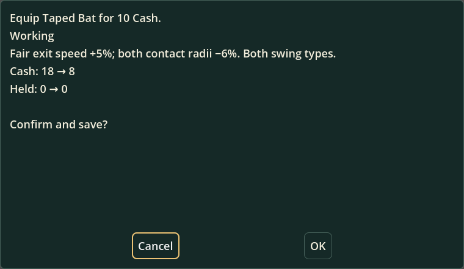

The actual paid copy/effect and Cash18→8 are visible together; Cancel begins focused. Both actions have the measured44-pixel hit area.

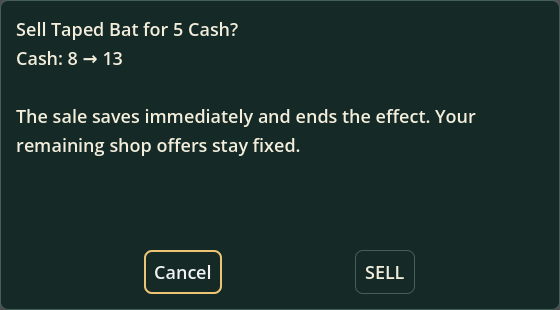

The quote shows refund5 and Cash8→13, explains immediate effect removal in the shop and fixed remaining offers, and starts on Cancel.

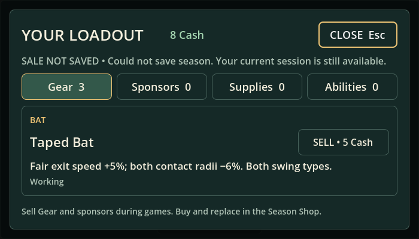

A rejected save leaves8 Cash and Taped Bat's sale action available, with visible feedback. Cancel preserves saved bytes; retry saves the exact refund/removal and agrees with reload.

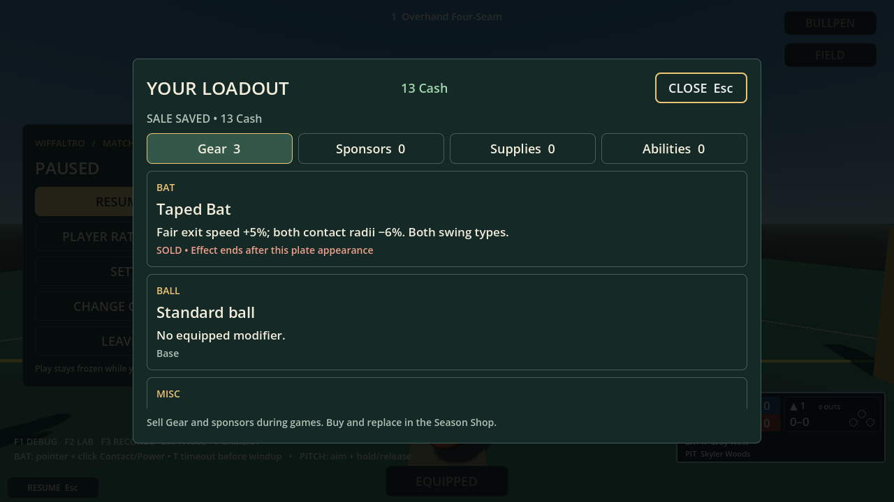

Cash13 is saved, Taped Bat has no resale action, and its current-PA effect is explicitly retained until the next batter. Existing-pause restoration and complete-game natural-boundary checks accompany this render.

[SHOP_ACCEPTANCE](SHOP_ACCEPTANCE.md) contains the hands-on walkthrough and isolated review-copy launcher. No unlock grants, price changes or regular-save copies are involved. Human visual/feel acceptance remains pending. See VERIFICATION for the final targeted scope and software-display limits.
